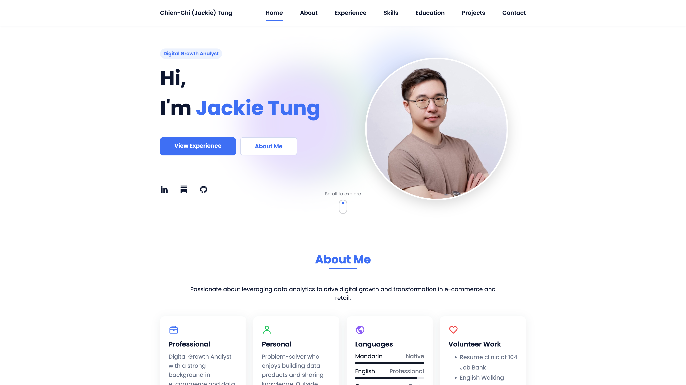

# Jackie Tung — Portfolio

Live site: https://chienchitung.github.io

## Preview

## What’s inside
- Home: Hero section with role tag, social links, and portrait.
- About: Professional, personal, languages, and volunteer highlights presented as cards.
- Experience: Detailed work history with timelines and achievements (IKEA, friDay Shopping, Circles.Life).
- Skills: Technical, business, industry knowledge, plus certifications listed as badges.
- Education: Academic background with timelines, GPA, awards, and conferences.
- Projects: Six featured items with overlays describing key outcomes and impact.
- Contact: Email form (Formspree), location link, and compact contact info row.
- Footer: Social profiles, back‑to‑top button, and copyright.

## Tech stack
- Static site: HTML5, CSS3 (SCSS source included), vanilla JavaScript.
- Icons & animations: Boxicons, ScrollReveal.
- Hosting & CI: GitHub Pages with GitHub Actions workflow (`.github/workflows/pages.yml`).

